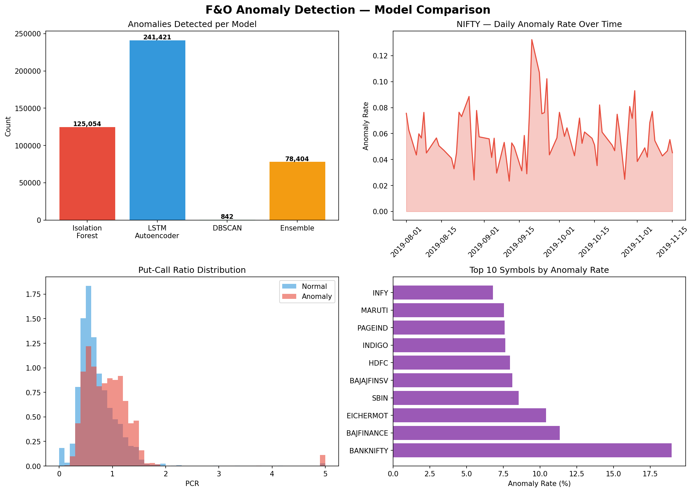
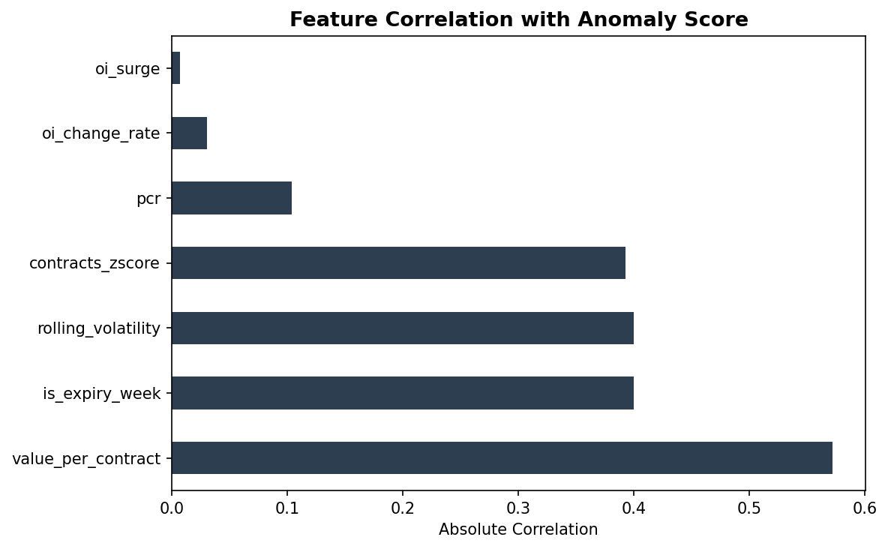

# 📊 F&O Anomaly Detection

> 3-model ensemble anomaly detection system trained on 2.5M+ real NSE/BSE/MCX Futures & Options trading records. Detects unusual option activity using engineered financial features and compares Isolation Forest, LSTM Autoencoder, and DBSCAN approaches.

---

## 🧠 What Is This?

This project builds a production-grade anomaly detection pipeline on real Indian derivatives market data. Instead of using synthetic or toy datasets, every model is trained on **2,533,210 rows** of actual NSE/BSE/MCX F&O trade records from August–October 2019.

The system flags unusual trading activity that could indicate:
- **Market manipulation** — abnormal OI accumulation
- **Informed trading** — unusual PCR shifts before events
- **Systemic risk signals** — correlated volatility spikes across contracts
- **Expiry-driven anomalies** — irregular activity in expiry weeks

---

## 🔍 Key Results

| Model | Anomalies Detected | Rate |
|---|---|---|
| Isolation Forest | 125,054 | 5.0% |
| LSTM Autoencoder | 241,421 | 9.7% |
| DBSCAN | 842 (subsample) | 1.7% |
| **Ensemble** | **78,404** | **3.1%** |
| All 3 agree | 651 | High confidence |

### 🗓️ Real-World Validation
The model flagged **September 20, 2019** as the most anomalous NIFTY trading day — 4 days after the **Saudi Aramco oil attack** (Sept 14, 2019) caused global market volatility. The system detected the downstream market stress without any labeled training data.

### 📈 Top Anomalous Symbols
BANKNIFTY showed the highest anomaly rate (19%), consistent with its position as India's most volatile options index.

### 🔑 Feature Importance
`value_per_contract` (0.57 correlation) emerged as the strongest anomaly signal, indicating that unusual money concentration per trade is the most reliable red flag — more predictive than raw OI or volume alone.

---

## 🏗️ Architecture

```
Raw F&O CSV (2.5M rows)
        │
        ▼
┌─────────────────────────────────────┐
│        Feature Engineering          │
│  • OI Change Rate                   │
│  • Volume Z-Score (per symbol)      │
│  • Rolling 7-day Volatility         │
│  • Put-Call Ratio (PCR)             │
│  • Days to Expiry / Expiry Week     │
│  • Value per Contract               │
│  • OI Surge (vs rolling mean)       │
└─────────────────────────────────────┘
        │
        ▼
┌──────────────────────────────────────────────────────┐
│                  3-Model Pipeline                     │
│                                                       │
│  ┌─────────────────┐  ┌─────────────────┐  ┌──────┐ │
│  │ Isolation Forest│  │ LSTM Autoencoder│  │DBSCAN│ │
│  │  n=200 trees    │  │ 2-layer encoder │  │ eps= │ │
│  │  contamination  │  │ + decoder       │  │ 0.5  │ │
│  │  = 5%           │  │ seq_len=10      │  │      │ │
│  │  Weight: 0.4    │  │ Weight: 0.4     │  │ 0.2  │ │
│  └─────────────────┘  └─────────────────┘  └──────┘ │
│                    │           │                │     │
│                    └─────┬─────┘                │     │
│                          ▼                      │     │
│              ┌───────────────────────┐          │     │
│              │   Weighted Ensemble   │◄─────────┘     │
│              │  score ≥ 0.5 = anomaly│                │
│              └───────────────────────┘                │
└──────────────────────────────────────────────────────┘
        │
        ▼
  Results + Visualizations
```

---

## 🧪 Models Explained

### 1. Isolation Forest
Unsupervised ensemble method that isolates anomalies by randomly partitioning the feature space. Anomalies require fewer splits to isolate — they're "easier to separate" from the crowd. Trained on the full 2.5M row dataset using all CPU cores.

### 2. LSTM Autoencoder
Deep learning approach for time-series anomaly detection. The model learns to reconstruct **normal** trading sequences. When reconstruction error exceeds the 95th percentile threshold, the sequence is flagged as anomalous. Trained on 100k sequences of length 10 using GPU acceleration.

### 3. DBSCAN
Density-based spatial clustering. Trading records that don't belong to any dense cluster are labeled as anomalies (label = -1). Run on a 50k stratified subsample due to O(n²) complexity.

### 4. Weighted Ensemble
Combines all three models with weights (0.4, 0.4, 0.2). A record is flagged as anomalous when the weighted score ≥ 0.5. This reduces false positives from any single model while preserving sensitivity.

---

## ⚙️ Feature Engineering

| Feature | Description | Why It Matters |
|---|---|---|
| `oi_change_rate` | CHG_IN_OI / OPEN_INT | Sudden OI shifts signal position buildup |
| `contracts_zscore` | Z-score of volume per symbol | Flags statistically unusual volume |
| `rolling_volatility` | 7-day std of price range | Captures volatility regime changes |
| `pcr` | Put OI / Call OI per day | Extreme PCR = market sentiment anomaly |
| `is_expiry_week` | Binary: days to expiry ≤ 7 | Expiry weeks have structurally different behaviour |
| `value_per_contract` | VAL_INLAKH / CONTRACTS | Unusual trade sizing = concentration risk |
| `oi_surge` | CHG_IN_OI vs 7-day rolling mean | Detects sudden OI accumulation vs baseline |

---

## 📁 Project Structure

```
fno-anomaly-detection/
├── src/
│   ├── features.py          # Feature engineering pipeline
│   └── models.py            # All 3 models + ensemble
├── notebooks/
│   └── FnO-Anomaly-Detection.ipynb   # Full Colab notebook
├── results/
│   ├── anomaly_detection_results.png # Model comparison charts
│   └── feature_importance.png        # Feature correlation plot
├── .gitignore
├── requirements.txt
└── README.md
```

---

## 🚀 Getting Started

### Prerequisites
- Python 3.10+
- GPU recommended for LSTM training (Google Colab T4 works great)

### Dataset
Download from Kaggle: [NSE Future and Options Dataset 3M](https://www.kaggle.com/datasets/sunnysai12345/nse-future-and-options-dataset-3m)

Place the CSV at `data/3mfanddo.csv`.

### Install dependencies

```bash
pip install -r requirements.txt
```

### Run feature engineering

```bash
python src/features.py
```

### Train all models

```bash
python src/models.py
```

Or run the full pipeline end-to-end in the Colab notebook.

---

## 📦 Dependencies

```
pandas
numpy
scikit-learn
torch
matplotlib
plotly
seaborn
scipy
```

---

## 📊 Visualizations

### Model Comparison + NIFTY Anomaly Timeline


### Feature Importance


---

## 💡 Key Findings

1. **value_per_contract** is the strongest anomaly signal (0.57 correlation) — unusual money per trade is more predictive than raw volume
2. **Expiry weeks** and **rolling volatility** are equally important (0.40 each) — market structure matters
3. **BANKNIFTY** has the highest anomaly rate (19%) — consistent with its volatility profile
4. The **ensemble outperforms** any single model by reducing false positives from LSTM's aggressive flagging while retaining Isolation Forest's precision
5. **Sept 20, 2019** was the most anomalous NIFTY day — correlates with post-Aramco global volatility

---

## 🗺️ Roadmap

- [ ] Streamlit dashboard for real-time anomaly monitoring
- [ ] Live NSE data feed integration
- [ ] Transformer-based sequence model (replace LSTM)
- [ ] Alert system for high-confidence anomalies
- [ ] Backtesting: do anomalies predict next-day returns?

---

## 👤 Author

**Saumya Goyal**
- GitHub: [@saumyg3](https://github.com/saumyg3)
- LinkedIn: [linkedin.com/in/saumyagoyal](https://linkedin.com/in/saumyagoyal)
- Email: saumyg3@uci.edu

---

## 📄 License

MIT License — free to use, modify, and distribute.

---

*Dataset: NSE/BSE/MCX F&O data (Aug–Oct 2019) via Kaggle. Models trained without any labeled anomaly ground truth — fully unsupervised.*
